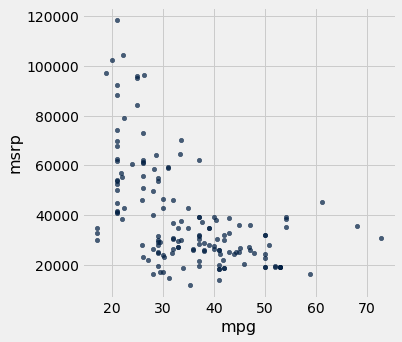
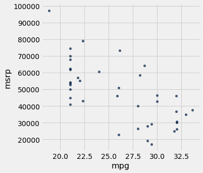
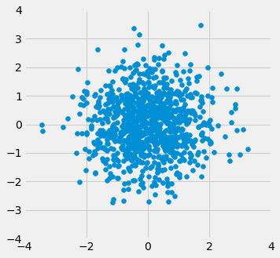
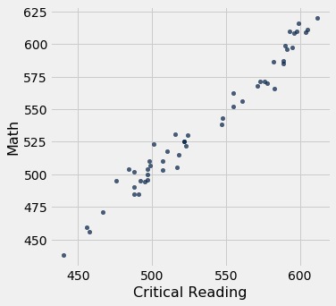

---
redirect_from:
  - "/chapters/15/1/correlation"
interact_link: content/chapters/15/1/Correlation.ipynb
kernel_name: python3
has_widgets: false
title: 'Correlation'
prev_page:
  url: /chapters/15/Prediction
  title: 'Prediction'
next_page:
  url: /chapters/15/2/Regression_Line
  title: 'The Regression Line'
comment: "***PROGRAMMATICALLY GENERATED, DO NOT EDIT. SEE ORIGINAL FILES IN /content***"
---


<div markdown="1" class="cell code_cell">


</div>


<div markdown="1" class="cell code_cell">


</div>


### Correlation

In this section we will develop a measure of how tightly clustered a scatter diagram is about a straight line. Formally, this is called measuring *linear association*.


The table `hybrid` contains data on hybrid passenger cars sold in the United States from 1997 to 2013. The data were adapted from the online data archive of [Prof. Larry Winner](http://www.stat.ufl.edu/%7Ewinner/) of the University of Florida. The columns:

- `vehicle`: model of the car
- `year`: year of manufacture
- `msrp`: manufacturer's suggested retail price in 2013 dollars
- `acceleration`: acceleration rate in km per hour per second
- `mpg`: fuel econonmy in miles per gallon
- `class`: the model's class.


<div markdown="1" class="cell code_cell">
<div class="input_area" markdown="1">
```python
hybrid = Table.read_table(path_data + 'hybrid.csv')

```
</div>

</div>


<div markdown="1" class="cell code_cell">
<div class="input_area" markdown="1">
```python
hybrid

```
</div>

<div class="output_wrapper" markdown="1">
<div class="output_subarea" markdown="1">


<div markdown="0" class="output output_html">
<table border="1" class="dataframe">
    <thead>
        <tr>
            <th>vehicle</th> <th>year</th> <th>msrp</th> <th>acceleration</th> <th>mpg</th> <th>class</th>
        </tr>
    </thead>
    <tbody>
        <tr>
            <td>Prius (1st Gen)</td> <td>1997</td> <td>24509.7</td> <td>7.46        </td> <td>41.26</td> <td>Compact   </td>
        </tr>
        <tr>
            <td>Tino           </td> <td>2000</td> <td>35355  </td> <td>8.2         </td> <td>54.1 </td> <td>Compact   </td>
        </tr>
        <tr>
            <td>Prius (2nd Gen)</td> <td>2000</td> <td>26832.2</td> <td>7.97        </td> <td>45.23</td> <td>Compact   </td>
        </tr>
        <tr>
            <td>Insight        </td> <td>2000</td> <td>18936.4</td> <td>9.52        </td> <td>53   </td> <td>Two Seater</td>
        </tr>
        <tr>
            <td>Civic (1st Gen)</td> <td>2001</td> <td>25833.4</td> <td>7.04        </td> <td>47.04</td> <td>Compact   </td>
        </tr>
        <tr>
            <td>Insight        </td> <td>2001</td> <td>19036.7</td> <td>9.52        </td> <td>53   </td> <td>Two Seater</td>
        </tr>
        <tr>
            <td>Insight        </td> <td>2002</td> <td>19137  </td> <td>9.71        </td> <td>53   </td> <td>Two Seater</td>
        </tr>
        <tr>
            <td>Alphard        </td> <td>2003</td> <td>38084.8</td> <td>8.33        </td> <td>40.46</td> <td>Minivan   </td>
        </tr>
        <tr>
            <td>Insight        </td> <td>2003</td> <td>19137  </td> <td>9.52        </td> <td>53   </td> <td>Two Seater</td>
        </tr>
        <tr>
            <td>Civic          </td> <td>2003</td> <td>14071.9</td> <td>8.62        </td> <td>41   </td> <td>Compact   </td>
        </tr>
    </tbody>
</table>
<p>... (143 rows omitted)</p>
</div>


</div>
</div>
</div>


The graph below is a scatter plot of `msrp` *versus* `acceleration`. That means `msrp` is plotted on the vertical axis and `accelaration` on the horizontal.


<div markdown="1" class="cell code_cell">
<div class="input_area" markdown="1">
```python
hybrid.scatter('acceleration', 'msrp')

```
</div>

<div class="output_wrapper" markdown="1">
<div class="output_subarea" markdown="1">

{:.output_png}


</div>
</div>
</div>


Notice the positive association. The scatter of points is sloping upwards, indicating that cars with greater acceleration tended to cost more, on average; conversely, the cars that cost more tended to have greater acceleration on average. 

The scatter diagram of MSRP versus mileage shows a negative association. Hybrid cars with higher mileage tended to cost less, on average. This seems surprising till you consider that cars that accelerate fast tend to be less fuel efficient and have lower mileage. As the previous scatter plot showed, those were also the cars that tended to cost more. 


<div markdown="1" class="cell code_cell">
<div class="input_area" markdown="1">
```python
hybrid.scatter('mpg', 'msrp')

```
</div>

<div class="output_wrapper" markdown="1">
<div class="output_subarea" markdown="1">

{:.output_png}


</div>
</div>
</div>


Along with the negative association, the scatter diagram of price versus efficiency shows a non-linear relation between the two variables. The points appear to be clustered around a curve, not around a straight line. 

If we restrict the data just to the SUV class, however, the association between price and efficiency is still negative but the relation appears to be more linear. The relation between the price and acceleration of SUV's also shows a linear trend, but with a positive slope.


<div markdown="1" class="cell code_cell">
<div class="input_area" markdown="1">
```python
suv = hybrid.where('class', 'SUV')
suv.scatter('mpg', 'msrp')

```
</div>

<div class="output_wrapper" markdown="1">
<div class="output_subarea" markdown="1">

{:.output_png}


</div>
</div>
</div>


<div markdown="1" class="cell code_cell">
<div class="input_area" markdown="1">
```python
suv.scatter('acceleration', 'msrp')

```
</div>

<div class="output_wrapper" markdown="1">
<div class="output_subarea" markdown="1">

{:.output_png}


</div>
</div>
</div>


You will have noticed that we can derive useful information from the general orientation and shape of a scatter diagram even without paying attention to the units in which the variables were measured.

Indeed, we could plot all the variables in standard units and the plots would look the same. This gives us a way to compare the degree of linearity in two scatter diagrams.

Recall that in an earlier section we defined the function `standard_units` to convert an array of numbers to standard units.


<div markdown="1" class="cell code_cell">
<div class="input_area" markdown="1">
```python
def standard_units(any_numbers):
    "Convert any array of numbers to standard units."
    return (any_numbers - np.mean(any_numbers))/np.std(any_numbers)  

```
</div>

</div>


We can use this function to re-draw the two scatter diagrams for SUVs, with all the variables measured in standard units.


<div markdown="1" class="cell code_cell">
<div class="input_area" markdown="1">
```python
Table().with_columns(
    'mpg (standard units)',  standard_units(suv.column('mpg')), 
    'msrp (standard units)', standard_units(suv.column('msrp'))
).scatter(0, 1)
plots.xlim(-3, 3)
plots.ylim(-3, 3);

```
</div>

<div class="output_wrapper" markdown="1">
<div class="output_subarea" markdown="1">

{:.output_png}


</div>
</div>
</div>


<div markdown="1" class="cell code_cell">
<div class="input_area" markdown="1">
```python
Table().with_columns(
    'acceleration (standard units)', standard_units(suv.column('acceleration')), 
    'msrp (standard units)',         standard_units(suv.column('msrp'))
).scatter(0, 1)
plots.xlim(-3, 3)
plots.ylim(-3, 3);

```
</div>

<div class="output_wrapper" markdown="1">
<div class="output_subarea" markdown="1">

{:.output_png}


</div>
</div>
</div>


The associations that we see in these figures are the same as those we saw before. Also, because the two scatter diagrams are now drawn on exactly the same scale, we can see that the linear relation in the second diagram is a little more fuzzy than in the first.

We will now define a measure that uses standard units to quantify the kinds of association that we have seen.


### The correlation coefficient

The *correlation coefficient* measures the strength of the linear relationship between two variables. Graphically, it measures how clustered the scatter diagram is around a straight line.

The term *correlation coefficient* isn't easy to say, so it is usually shortened to *correlation* and denoted by $r$.

Here are some mathematical facts about $r$ that we will just observe by simulation.

- The correlation coefficient $r$ is a number between $-1$ and 1.
- $r$ measures the extent to which the scatter plot clusters around a straight line.
- $r = 1$ if the scatter diagram is a perfect straight line sloping upwards, and $r = -1$ if the scatter diagram is a perfect straight line sloping downwards.


The function ``r_scatter`` takes a value of $r$ as its argument and simulates a scatter plot with a correlation very close to $r$. Because of randomness in the simulation, the correlation is not expected to be exactly equal to $r$.

Call ``r_scatter`` a few times, with different values of $r$ as the argument, and see how the scatter plot changes. 

When $r=1$ the scatter plot is perfectly linear and slopes upward. When $r=-1$, the scatter plot is perfectly linear and slopes downward. When $r=0$, the scatter plot is a formless cloud around the horizontal axis, and the variables are said to be *uncorrelated*.


<div markdown="1" class="cell code_cell">
<div class="input_area" markdown="1">
```python
r_scatter(0.9)

```
</div>

<div class="output_wrapper" markdown="1">
<div class="output_subarea" markdown="1">

{:.output_png}


</div>
</div>
</div>


<div markdown="1" class="cell code_cell">
<div class="input_area" markdown="1">
```python
r_scatter(0.25)

```
</div>

<div class="output_wrapper" markdown="1">
<div class="output_subarea" markdown="1">

{:.output_png}


</div>
</div>
</div>


<div markdown="1" class="cell code_cell">
<div class="input_area" markdown="1">
```python
r_scatter(0)

```
</div>

<div class="output_wrapper" markdown="1">
<div class="output_subarea" markdown="1">

{:.output_png}


</div>
</div>
</div>


<div markdown="1" class="cell code_cell">
<div class="input_area" markdown="1">
```python
r_scatter(-0.55)

```
</div>

<div class="output_wrapper" markdown="1">
<div class="output_subarea" markdown="1">

{:.output_png}


</div>
</div>
</div>


### Calculating $r$

The formula for $r$ is not apparent from our observations so far. It has a mathematical basis that is outside the scope of this class. However, as you will see, the calculation is straightforward and helps us understand several of the properties of $r$.

**Formula for $r$**:

**$r$ is the average of the products of the two variables, when both variables are measured in standard units.**

Here are the steps in the calculation. We will apply the steps to a simple table of values of $x$ and $y$.


<div markdown="1" class="cell code_cell">
<div class="input_area" markdown="1">
```python
x = np.arange(1, 7, 1)
y = make_array(2, 3, 1, 5, 2, 7)
t = Table().with_columns(
        'x', x,
        'y', y
    )
t

```
</div>

<div class="output_wrapper" markdown="1">
<div class="output_subarea" markdown="1">


<div markdown="0" class="output output_html">
<table border="1" class="dataframe">
    <thead>
        <tr>
            <th>x</th> <th>y</th>
        </tr>
    </thead>
    <tbody>
        <tr>
            <td>1   </td> <td>2   </td>
        </tr>
        <tr>
            <td>2   </td> <td>3   </td>
        </tr>
        <tr>
            <td>3   </td> <td>1   </td>
        </tr>
        <tr>
            <td>4   </td> <td>5   </td>
        </tr>
        <tr>
            <td>5   </td> <td>2   </td>
        </tr>
        <tr>
            <td>6   </td> <td>7   </td>
        </tr>
    </tbody>
</table>
</div>


</div>
</div>
</div>


Based on the scatter diagram, we expect that $r$ will be positive but not equal to 1.


<div markdown="1" class="cell code_cell">
<div class="input_area" markdown="1">
```python
t.scatter(0, 1, s=30, color='red')

```
</div>

<div class="output_wrapper" markdown="1">
<div class="output_subarea" markdown="1">

{:.output_png}


</div>
</div>
</div>


**Step 1.** Convert each variable to standard units.


<div markdown="1" class="cell code_cell">
<div class="input_area" markdown="1">
```python
t_su = t.with_columns(
        'x (standard units)', standard_units(x),
        'y (standard units)', standard_units(y)
    )
t_su

```
</div>

<div class="output_wrapper" markdown="1">
<div class="output_subarea" markdown="1">


<div markdown="0" class="output output_html">
<table border="1" class="dataframe">
    <thead>
        <tr>
            <th>x</th> <th>y</th> <th>x (standard units)</th> <th>y (standard units)</th>
        </tr>
    </thead>
    <tbody>
        <tr>
            <td>1   </td> <td>2   </td> <td>-1.46385          </td> <td>-0.648886         </td>
        </tr>
        <tr>
            <td>2   </td> <td>3   </td> <td>-0.87831          </td> <td>-0.162221         </td>
        </tr>
        <tr>
            <td>3   </td> <td>1   </td> <td>-0.29277          </td> <td>-1.13555          </td>
        </tr>
        <tr>
            <td>4   </td> <td>5   </td> <td>0.29277           </td> <td>0.811107          </td>
        </tr>
        <tr>
            <td>5   </td> <td>2   </td> <td>0.87831           </td> <td>-0.648886         </td>
        </tr>
        <tr>
            <td>6   </td> <td>7   </td> <td>1.46385           </td> <td>1.78444           </td>
        </tr>
    </tbody>
</table>
</div>


</div>
</div>
</div>


**Step 2.** Multiply each pair of standard units.


<div markdown="1" class="cell code_cell">
<div class="input_area" markdown="1">
```python
t_product = t_su.with_column('product of standard units', t_su.column(2) * t_su.column(3))
t_product

```
</div>

<div class="output_wrapper" markdown="1">
<div class="output_subarea" markdown="1">


<div markdown="0" class="output output_html">
<table border="1" class="dataframe">
    <thead>
        <tr>
            <th>x</th> <th>y</th> <th>x (standard units)</th> <th>y (standard units)</th> <th>product of standard units</th>
        </tr>
    </thead>
    <tbody>
        <tr>
            <td>1   </td> <td>2   </td> <td>-1.46385          </td> <td>-0.648886         </td> <td>0.949871                 </td>
        </tr>
        <tr>
            <td>2   </td> <td>3   </td> <td>-0.87831          </td> <td>-0.162221         </td> <td>0.142481                 </td>
        </tr>
        <tr>
            <td>3   </td> <td>1   </td> <td>-0.29277          </td> <td>-1.13555          </td> <td>0.332455                 </td>
        </tr>
        <tr>
            <td>4   </td> <td>5   </td> <td>0.29277           </td> <td>0.811107          </td> <td>0.237468                 </td>
        </tr>
        <tr>
            <td>5   </td> <td>2   </td> <td>0.87831           </td> <td>-0.648886         </td> <td>-0.569923                </td>
        </tr>
        <tr>
            <td>6   </td> <td>7   </td> <td>1.46385           </td> <td>1.78444           </td> <td>2.61215                  </td>
        </tr>
    </tbody>
</table>
</div>


</div>
</div>
</div>


**Step 3.** $r$ is the average of the products computed in Step 2.


<div markdown="1" class="cell code_cell">
<div class="input_area" markdown="1">
```python
# r is the average of the products of standard units

r = np.mean(t_product.column(4))
r

```
</div>

<div class="output_wrapper" markdown="1">
<div class="output_subarea" markdown="1">


{:.output_data_text}
```
0.6174163971897709
```


</div>
</div>
</div>


As expected, $r$ is positive but not equal to 1.


### Properties of $r$

The calculation shows that:

- $r$ is a pure number. It has no units. This is because $r$ is based on standard units.
- $r$ is unaffected by changing the units on either axis. This too is because $r$ is based on standard units.
- $r$ is unaffected by switching the axes. Algebraically, this is because the product of standard units does not depend on which variable is called $x$ and which $y$. Geometrically, switching axes reflects the scatter plot about the line $y=x$, but does not change the amount of clustering nor the sign of the association.


<div markdown="1" class="cell code_cell">
<div class="input_area" markdown="1">
```python
t.scatter('y', 'x', s=30, color='red')

```
</div>

<div class="output_wrapper" markdown="1">
<div class="output_subarea" markdown="1">

{:.output_png}


</div>
</div>
</div>


### The `correlation` function
We are going to be calculating correlations repeatedly, so it will help to define a function that computes it by performing all the steps described above. Let's define a function ``correlation`` that takes a table and the labels of two columns in the table. The function returns $r$, the mean of the products of those column values in standard units.


<div markdown="1" class="cell code_cell">
<div class="input_area" markdown="1">
```python
def correlation(t, x, y):
    return np.mean(standard_units(t.column(x))*standard_units(t.column(y)))

```
</div>

</div>


Let's call the function on the ``x`` and ``y`` columns of ``t``. The function returns the same answer to the correlation between $x$ and $y$ as we got by direct application of the formula for $r$. 


<div markdown="1" class="cell code_cell">
<div class="input_area" markdown="1">
```python
correlation(t, 'x', 'y')

```
</div>

<div class="output_wrapper" markdown="1">
<div class="output_subarea" markdown="1">


{:.output_data_text}
```
0.6174163971897709
```


</div>
</div>
</div>


As we noticed, the order in which the variables are specified doesn't matter.


<div markdown="1" class="cell code_cell">
<div class="input_area" markdown="1">
```python
correlation(t, 'y', 'x')

```
</div>

<div class="output_wrapper" markdown="1">
<div class="output_subarea" markdown="1">


{:.output_data_text}
```
0.6174163971897709
```


</div>
</div>
</div>


Calling ``correlation`` on columns of the table ``suv`` gives us the correlation between price and mileage as well as the correlation between price and acceleration.


<div markdown="1" class="cell code_cell">
<div class="input_area" markdown="1">
```python
correlation(suv, 'mpg', 'msrp')

```
</div>

<div class="output_wrapper" markdown="1">
<div class="output_subarea" markdown="1">


{:.output_data_text}
```
-0.6667143635709919
```


</div>
</div>
</div>


<div markdown="1" class="cell code_cell">
<div class="input_area" markdown="1">
```python
correlation(suv, 'acceleration', 'msrp')

```
</div>

<div class="output_wrapper" markdown="1">
<div class="output_subarea" markdown="1">


{:.output_data_text}
```
0.48699799279959155
```


</div>
</div>
</div>


These values confirm what we had observed: 

- There is a negative association between price and efficiency, whereas the association between price and acceleration is positive.
- The linear relation between price and acceleration is a little weaker (correlation about 0.5) than between price and mileage (correlation about -0.67). 


Correlation is a simple and powerful concept, but it is sometimes misused. Before using $r$, it is important to be aware of what correlation does and does not measure.


### Association is not Causation

Correlation only measures association. Correlation does not imply causation. Though the correlation between the weight and the math ability of children in a school district may be positive, that does not mean that doing math makes children heavier or that putting on weight improves the children's math skills. Age is a confounding variable: older children are both heavier and better at math than younger children, on average.


### Correlation Measures *Linear* Association
Correlation measures only one kind of association – linear. Variables that have strong non-linear association might have very low correlation. Here is an example of variables that have a perfect quadratic relation $y = x^2$ but have correlation equal to 0.


<div markdown="1" class="cell code_cell">
<div class="input_area" markdown="1">
```python
new_x = np.arange(-4, 4.1, 0.5)
nonlinear = Table().with_columns(
        'x', new_x,
        'y', new_x**2
    )
nonlinear.scatter('x', 'y', s=30, color='r')

```
</div>

<div class="output_wrapper" markdown="1">
<div class="output_subarea" markdown="1">

{:.output_png}


</div>
</div>
</div>


<div markdown="1" class="cell code_cell">
<div class="input_area" markdown="1">
```python
correlation(nonlinear, 'x', 'y')

```
</div>

<div class="output_wrapper" markdown="1">
<div class="output_subarea" markdown="1">


{:.output_data_text}
```
0.0
```


</div>
</div>
</div>


### Correlation is Affected by Outliers
Outliers can have a big effect on correlation. Here is an example where a scatter plot for which $r$ is equal to 1 is turned into a plot for which $r$ is equal to 0, by the addition of just one outlying point.


<div markdown="1" class="cell code_cell">
<div class="input_area" markdown="1">
```python
line = Table().with_columns(
        'x', make_array(1, 2, 3, 4),
        'y', make_array(1, 2, 3, 4)
    )
line.scatter('x', 'y', s=30, color='r')

```
</div>

<div class="output_wrapper" markdown="1">
<div class="output_subarea" markdown="1">

{:.output_png}


</div>
</div>
</div>


<div markdown="1" class="cell code_cell">
<div class="input_area" markdown="1">
```python
correlation(line, 'x', 'y')

```
</div>

<div class="output_wrapper" markdown="1">
<div class="output_subarea" markdown="1">


{:.output_data_text}
```
1.0
```


</div>
</div>
</div>


<div markdown="1" class="cell code_cell">
<div class="input_area" markdown="1">
```python
outlier = Table().with_columns(
        'x', make_array(1, 2, 3, 4, 5),
        'y', make_array(1, 2, 3, 4, 0)
    )
outlier.scatter('x', 'y', s=30, color='r')

```
</div>

<div class="output_wrapper" markdown="1">
<div class="output_subarea" markdown="1">

{:.output_png}


</div>
</div>
</div>


<div markdown="1" class="cell code_cell">
<div class="input_area" markdown="1">
```python
correlation(outlier, 'x', 'y')

```
</div>

<div class="output_wrapper" markdown="1">
<div class="output_subarea" markdown="1">


{:.output_data_text}
```
0.0
```


</div>
</div>
</div>


### Ecological Correlations Should be Interpreted with Care
Correlations based on aggregated data can be misleading. As an example, here are data on the Critical Reading and Math SAT scores in 2014. There is one point for each of the 50 states and one for Washington, D.C. The column ``Participation Rate`` contains the percent of high school seniors who took the test. The next three columns show the average score in the state on each portion of the test, and the final column is the average of the total scores on the test.


<div markdown="1" class="cell code_cell">
<div class="input_area" markdown="1">
```python
sat2014 = Table.read_table(path_data + 'sat2014.csv').sort('State')
sat2014

```
</div>

<div class="output_wrapper" markdown="1">
<div class="output_subarea" markdown="1">


<div markdown="0" class="output output_html">
<table border="1" class="dataframe">
    <thead>
        <tr>
            <th>State</th> <th>Participation Rate</th> <th>Critical Reading</th> <th>Math</th> <th>Writing</th> <th>Combined</th>
        </tr>
    </thead>
    <tbody>
        <tr>
            <td>Alabama             </td> <td>6.7               </td> <td>547             </td> <td>538 </td> <td>532    </td> <td>1617    </td>
        </tr>
        <tr>
            <td>Alaska              </td> <td>54.2              </td> <td>507             </td> <td>503 </td> <td>475    </td> <td>1485    </td>
        </tr>
        <tr>
            <td>Arizona             </td> <td>36.4              </td> <td>522             </td> <td>525 </td> <td>500    </td> <td>1547    </td>
        </tr>
        <tr>
            <td>Arkansas            </td> <td>4.2               </td> <td>573             </td> <td>571 </td> <td>554    </td> <td>1698    </td>
        </tr>
        <tr>
            <td>California          </td> <td>60.3              </td> <td>498             </td> <td>510 </td> <td>496    </td> <td>1504    </td>
        </tr>
        <tr>
            <td>Colorado            </td> <td>14.3              </td> <td>582             </td> <td>586 </td> <td>567    </td> <td>1735    </td>
        </tr>
        <tr>
            <td>Connecticut         </td> <td>88.4              </td> <td>507             </td> <td>510 </td> <td>508    </td> <td>1525    </td>
        </tr>
        <tr>
            <td>Delaware            </td> <td>100               </td> <td>456             </td> <td>459 </td> <td>444    </td> <td>1359    </td>
        </tr>
        <tr>
            <td>District of Columbia</td> <td>100               </td> <td>440             </td> <td>438 </td> <td>431    </td> <td>1309    </td>
        </tr>
        <tr>
            <td>Florida             </td> <td>72.2              </td> <td>491             </td> <td>485 </td> <td>472    </td> <td>1448    </td>
        </tr>
    </tbody>
</table>
<p>... (41 rows omitted)</p>
</div>


</div>
</div>
</div>


The scatter diagram of Math scores versus Critical Reading scores is very tightly clustered around a straight line; the correlation is close to 0.985. 


<div markdown="1" class="cell code_cell">
<div class="input_area" markdown="1">
```python
sat2014.scatter('Critical Reading', 'Math')

```
</div>

<div class="output_wrapper" markdown="1">
<div class="output_subarea" markdown="1">

{:.output_png}


</div>
</div>
</div>


<div markdown="1" class="cell code_cell">
<div class="input_area" markdown="1">
```python
correlation(sat2014, 'Critical Reading', 'Math')

```
</div>

<div class="output_wrapper" markdown="1">
<div class="output_subarea" markdown="1">


{:.output_data_text}
```
0.9847558411067434
```


</div>
</div>
</div>


That's an extremely high correlation. But it's important to note that this does not reflect the strength of the relation between the Math and Critical Reading scores of *students*. 

The data consist of average scores in each state. But states don't take tests – students do. The data in the table have been created by lumping all the students in each state into a single point at the average values of the two variables in that state. But not all students in the state will be at that point, as students vary in their performance. If you plot a point for each student instead of just one for each state, there will be a cloud of points around each point in the figure above. The overall picture will be more fuzzy. The correlation between the Math and Critical Reading scores of the students will be *lower* than the value calculated based on state averages.

Correlations based on aggregates and averages are called *ecological correlations* and are frequently reported. As we have just seen, they must be interpreted with care.


### Serious or tongue-in-cheek?

In 2012, a [paper](http://www.biostat.jhsph.edu/courses/bio621/misc/Chocolate%20consumption%20cognitive%20function%20and%20nobel%20laurates%20%28NEJM%29.pdf) in the respected New England Journal of Medicine examined the relation between chocolate consumption and Nobel Prizes in a group of countries. The [Scientific American](http://blogs.scientificamerican.com/the-curious-wavefunction/chocolate-consumption-and-nobel-prizes-a-bizarre-juxtaposition-if-there-ever-was-one/) responded seriously whereas
[others](http://www.reuters.com/article/2012/10/10/us-eat-chocolate-win-the-nobel-prize-idUSBRE8991MS20121010#vFdfFkbPVlilSjsB.97) were more relaxed. You are welcome to make your own decision! The following graph, provided in the paper, should motivate you to go and take a look.


<div markdown="1" class="cell code_cell">


<div class="output_wrapper" markdown="1">
<div class="output_subarea" markdown="1">


{:.output_png}


</div>
</div>
</div>

