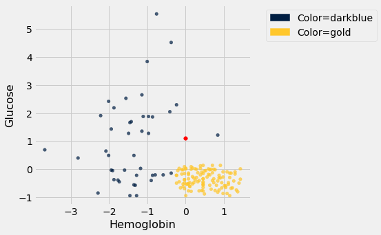
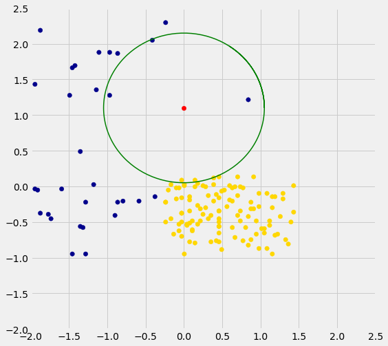

---
redirect_from:
  - "/chapters/17/3/rows-of-tables"
interact_link: content/chapters/17/3/Rows_of_Tables.ipynb
kernel_name: python3
has_widgets: false
title: 'Rows of Tables'
prev_page:
  url: /chapters/17/2/Training_and_Testing
  title: 'Training and Testing'
next_page:
  url: /chapters/17/4/Implementing_the_Classifier
  title: 'Implementing the Classifier'
comment: "***PROGRAMMATICALLY GENERATED, DO NOT EDIT. SEE ORIGINAL FILES IN /content***"
---


<div markdown="1" class="cell code_cell">


</div>


<div markdown="1" class="cell code_cell">


</div>


### Rows of Tables
Now that we have a qualitative understanding of nearest neighbor classification, it's time to implement our classifier.

Until this chapter, we have worked mostly with single columns of tables. But now we have to see whether one *individual* is "close" to another. Data for individuals are contained in *rows* of tables.

So let's start by taking a closer look at rows.


Here is the original table `ckd` containing data on patients who were tested for chronic kidney disease.


<div markdown="1" class="cell code_cell">
<div class="input_area" markdown="1">
```python
ckd = Table.read_table(path_data + 'ckd.csv').relabeled('Blood Glucose Random', 'Glucose')

```
</div>

</div>


The data corresponding to the first patient is in row 0 of the table, consistent with Python's indexing system. The Table method `row` accesses the row by taking the index of the row as its argument:


<div markdown="1" class="cell code_cell">
<div class="input_area" markdown="1">
```python
ckd.row(0)

```
</div>

<div class="output_wrapper" markdown="1">
<div class="output_subarea" markdown="1">


{:.output_data_text}
```
Row(Age=48, Blood Pressure=70, Specific Gravity=1.005, Albumin=4, Sugar=0, Red Blood Cells='normal', Pus Cell='abnormal', Pus Cell clumps='present', Bacteria='notpresent', Glucose=117, Blood Urea=56, Serum Creatinine=3.8, Sodium=111, Potassium=2.5, Hemoglobin=11.2, Packed Cell Volume=32, White Blood Cell Count=6700, Red Blood Cell Count=3.9, Hypertension='yes', Diabetes Mellitus='no', Coronary Artery Disease='no', Appetite='poor', Pedal Edema='yes', Anemia='yes', Class=1)
```


</div>
</div>
</div>


Rows have their very own data type: they are *row objects*. Notice how the display shows not only the values in the row but also the labels of the corresponding columns.

Rows are in general **not arrays**, as their elements can be of different types. For example, some of the elements of the row above are strings (like `'abnormal'`) and some are numerical. So the row can't be converted into an array.

However, rows share some characteristics with arrays.  You can use `item` to access a particular element of a row. For example, to access the Albumin level of Patient 0, we can look at the labels in the printout of the row above to find that it's item 3:


<div markdown="1" class="cell code_cell">
<div class="input_area" markdown="1">
```python
ckd.row(0).item(3)

```
</div>

<div class="output_wrapper" markdown="1">
<div class="output_subarea" markdown="1">


{:.output_data_text}
```
4
```


</div>
</div>
</div>


### Converting Rows to Arrays (When Possible)
Rows whose elements are all numerical (or all strings) can be converted to arrays.  Converting a row to an array gives us access to arithmetic operations and other nice NumPy functions, so it is often useful.

Recall that in the previous section we tried to classify the patients as 'CKD' or 'not CKD', based on two attributes `Hemoglobin` and `Glucose`, both measured in standard units. 


<div markdown="1" class="cell code_cell">
<div class="input_area" markdown="1">
```python
ckd = Table().with_columns(
    'Hemoglobin', standard_units(ckd.column('Hemoglobin')),
    'Glucose', standard_units(ckd.column('Glucose')),
    'Class', ckd.column('Class')
)

color_table = Table().with_columns(
    'Class', make_array(1, 0),
    'Color', make_array('darkblue', 'gold')
)
ckd = ckd.join('Class', color_table)
ckd

```
</div>

<div class="output_wrapper" markdown="1">
<div class="output_subarea" markdown="1">


<div markdown="0" class="output output_html">
<table border="1" class="dataframe">
    <thead>
        <tr>
            <th>Class</th> <th>Hemoglobin</th> <th>Glucose</th> <th>Color</th>
        </tr>
    </thead>
    <tbody>
        <tr>
            <td>0    </td> <td>0.456884  </td> <td>0.133751   </td> <td>gold </td>
        </tr>
        <tr>
            <td>0    </td> <td>1.153     </td> <td>-0.947597  </td> <td>gold </td>
        </tr>
        <tr>
            <td>0    </td> <td>0.770138  </td> <td>-0.762223  </td> <td>gold </td>
        </tr>
        <tr>
            <td>0    </td> <td>0.596108  </td> <td>-0.190654  </td> <td>gold </td>
        </tr>
        <tr>
            <td>0    </td> <td>-0.239236 </td> <td>-0.49961   </td> <td>gold </td>
        </tr>
        <tr>
            <td>0    </td> <td>-0.0304002</td> <td>-0.159758  </td> <td>gold </td>
        </tr>
        <tr>
            <td>0    </td> <td>0.282854  </td> <td>-0.00527964</td> <td>gold </td>
        </tr>
        <tr>
            <td>0    </td> <td>0.108824  </td> <td>-0.623193  </td> <td>gold </td>
        </tr>
        <tr>
            <td>0    </td> <td>0.0740178 </td> <td>-0.515058  </td> <td>gold </td>
        </tr>
        <tr>
            <td>0    </td> <td>0.83975   </td> <td>-0.422371  </td> <td>gold </td>
        </tr>
    </tbody>
</table>
<p>... (148 rows omitted)</p>
</div>


</div>
</div>
</div>


Here is a scatter plot of the two attributes, along with a red point corresponding to Alice, a new patient. Her value of hemoglobin is 0 (that is, at the average) and glucose 1.1 (that is, 1.1 SDs above average).


<div markdown="1" class="cell code_cell">
<div class="input_area" markdown="1">
```python
alice = make_array(0, 1.1)
ckd.scatter('Hemoglobin', 'Glucose', group='Color')
plots.scatter(alice.item(0), alice.item(1), color='red', s=30);

```
</div>

<div class="output_wrapper" markdown="1">
<div class="output_subarea" markdown="1">

{:.output_png}


</div>
</div>
</div>


To find the distance between Alice's point and any of the other points, we only need the values of the attributes:


<div markdown="1" class="cell code_cell">
<div class="input_area" markdown="1">
```python
ckd_attributes = ckd.select('Hemoglobin', 'Glucose')

```
</div>

</div>


<div markdown="1" class="cell code_cell">
<div class="input_area" markdown="1">
```python
ckd_attributes

```
</div>

<div class="output_wrapper" markdown="1">
<div class="output_subarea" markdown="1">


<div markdown="0" class="output output_html">
<table border="1" class="dataframe">
    <thead>
        <tr>
            <th>Hemoglobin</th> <th>Glucose</th>
        </tr>
    </thead>
    <tbody>
        <tr>
            <td>0.456884  </td> <td>0.133751   </td>
        </tr>
        <tr>
            <td>1.153     </td> <td>-0.947597  </td>
        </tr>
        <tr>
            <td>0.770138  </td> <td>-0.762223  </td>
        </tr>
        <tr>
            <td>0.596108  </td> <td>-0.190654  </td>
        </tr>
        <tr>
            <td>-0.239236 </td> <td>-0.49961   </td>
        </tr>
        <tr>
            <td>-0.0304002</td> <td>-0.159758  </td>
        </tr>
        <tr>
            <td>0.282854  </td> <td>-0.00527964</td>
        </tr>
        <tr>
            <td>0.108824  </td> <td>-0.623193  </td>
        </tr>
        <tr>
            <td>0.0740178 </td> <td>-0.515058  </td>
        </tr>
        <tr>
            <td>0.83975   </td> <td>-0.422371  </td>
        </tr>
    </tbody>
</table>
<p>... (148 rows omitted)</p>
</div>


</div>
</div>
</div>


Each row consists of the coordinates of one point in our training sample. **Because the rows now consist only of numerical values**, it is possible to convert them to arrays.  For this, we use the function `np.array`, which converts any kind of sequential object, like a row, to an array. (Our old friend `make_array` is for *creating* arrays, not for *converting* other kinds of sequences to arrays.)


<div markdown="1" class="cell code_cell">
<div class="input_area" markdown="1">
```python
ckd_attributes.row(3)

```
</div>

<div class="output_wrapper" markdown="1">
<div class="output_subarea" markdown="1">


{:.output_data_text}
```
Row(Hemoglobin=0.5961076648232668, Glucose=-0.19065363034327712)
```


</div>
</div>
</div>


<div markdown="1" class="cell code_cell">
<div class="input_area" markdown="1">
```python
np.array(ckd_attributes.row(3))

```
</div>

<div class="output_wrapper" markdown="1">
<div class="output_subarea" markdown="1">


{:.output_data_text}
```
array([ 0.59610766, -0.19065363])
```


</div>
</div>
</div>


This is very handy because we can now use array operations on the data in each row.


### Distance Between Points When There are Two Attributes
The main calculation we need to do is to find the distance between Alice's point and any other point. For this, the first thing we need is a way to compute the distance between any pair of points. 

How do we do this?  In 2-dimensional space, it's pretty easy.  If we have a point at coordinates $(x_0,y_0)$ and another at $(x_1,y_1)$, the distance between them is

$$
D = \sqrt{(x_0-x_1)^2 + (y_0-y_1)^2}
$$

(Where did this come from?  It comes from the Pythogorean theorem: we have a right triangle with side lengths $x_0-x_1$ and $y_0-y_1$, and we want to find the length of the hypotenuse.)


In the next section we'll see that this formula has a straightforward extension when there are more than two attributes. For now, let's use the formula and array operations to find the distance between Alice and the patient in Row 3.


<div markdown="1" class="cell code_cell">
<div class="input_area" markdown="1">
```python
patient3 = np.array(ckd_attributes.row(3))
alice, patient3

```
</div>

<div class="output_wrapper" markdown="1">
<div class="output_subarea" markdown="1">


{:.output_data_text}
```
(array([0. , 1.1]), array([ 0.59610766, -0.19065363]))
```


</div>
</div>
</div>


<div markdown="1" class="cell code_cell">
<div class="input_area" markdown="1">
```python
distance = np.sqrt(np.sum((alice - patient3)**2))
distance

```
</div>

<div class="output_wrapper" markdown="1">
<div class="output_subarea" markdown="1">


{:.output_data_text}
```
1.421664918881847
```


</div>
</div>
</div>


We're going to need the distance between Alice and a bunch of points, so let's write a function called `distance` that computes the distance between any pair of points. The function will take two arrays, each containing the $(x, y)$ coordinates of a point.  (Remember, those are really the Hemoglobin and Glucose levels of a patient.)


<div markdown="1" class="cell code_cell">
<div class="input_area" markdown="1">
```python
def distance(point1, point2):
    """Returns the Euclidean distance between point1 and point2.
    
    Each argument is an array containing the coordinates of a point."""
    return np.sqrt(np.sum((point1 - point2)**2))

```
</div>

</div>


<div markdown="1" class="cell code_cell">
<div class="input_area" markdown="1">
```python
distance(alice, patient3)

```
</div>

<div class="output_wrapper" markdown="1">
<div class="output_subarea" markdown="1">


{:.output_data_text}
```
1.421664918881847
```


</div>
</div>
</div>


We have begun to build our classifier: the `distance` function is the first building block. Now let's work on the next piece.


### Using `apply` on an Entire Row
Recall that if you want to apply a function to each element of a column of a table, one way to do that is by the call `table_name.apply(function_name, column_label)`. This evaluates to an array consisting of the values of the function when we call it on each element of the column. So each entry of the array is based on the corresponding row of the table.

If you use `apply` without specifying a column label, then the entire row is passed to the function. Let's see how this works on a very small table `t` containing the information about the first five patients in the training sample.


<div markdown="1" class="cell code_cell">
<div class="input_area" markdown="1">
```python
t = ckd_attributes.take(np.arange(5))
t

```
</div>

<div class="output_wrapper" markdown="1">
<div class="output_subarea" markdown="1">


<div markdown="0" class="output output_html">
<table border="1" class="dataframe">
    <thead>
        <tr>
            <th>Hemoglobin</th> <th>Glucose</th>
        </tr>
    </thead>
    <tbody>
        <tr>
            <td>0.456884  </td> <td>0.133751 </td>
        </tr>
        <tr>
            <td>1.153     </td> <td>-0.947597</td>
        </tr>
        <tr>
            <td>0.770138  </td> <td>-0.762223</td>
        </tr>
        <tr>
            <td>0.596108  </td> <td>-0.190654</td>
        </tr>
        <tr>
            <td>-0.239236 </td> <td>-0.49961 </td>
        </tr>
    </tbody>
</table>
</div>


</div>
</div>
</div>


Just as an example, suppose that for each patient we want to know how unusual their most unusual attribute is.  Concretely, if a patient's hemoglobin level is further from the average than her glucose level, we want to know how far it is from the average.  If her glucose level is further from the average than her hemoglobin level, we want to know how far that is from the average instead.

That's the same as taking the maximum of the absolute values of the two quantities. To do this for a particular row, we can convert the row to an array and use array operations.


<div markdown="1" class="cell code_cell">
<div class="input_area" markdown="1">
```python
def max_abs(row):
    return np.max(np.abs(np.array(row)))

```
</div>

</div>


<div markdown="1" class="cell code_cell">
<div class="input_area" markdown="1">
```python
max_abs(t.row(4))

```
</div>

<div class="output_wrapper" markdown="1">
<div class="output_subarea" markdown="1">


{:.output_data_text}
```
0.4996102825918697
```


</div>
</div>
</div>


And now we can apply `max_abs` to each row of the table `t`:


<div markdown="1" class="cell code_cell">
<div class="input_area" markdown="1">
```python
t.apply(max_abs)

```
</div>

<div class="output_wrapper" markdown="1">
<div class="output_subarea" markdown="1">


{:.output_data_text}
```
array([0.4568837 , 1.15300352, 0.77013762, 0.59610766, 0.49961028])
```


</div>
</div>
</div>


This way of using `apply` will help us create the next building block of our classifier.


### Alice's $k$ Nearest Neighbors
If we want to classify Alice using a k-nearest neighbor classifier, we have to identify her $k$ nearest neighbors. What are the steps in this process? Suppose $k = 5$. Then the steps are:
- **Step 1.** Find the distance between Alice and each point in the training sample.
- **Step 2.** Sort the data table in increasing order of the distances.
- **Step 3.** Take the top 5 rows of the sorted table.

Steps 2 and 3 seem straightforward, provided we have the distances. So let's focus on Step 1.

Here's Alice:


<div markdown="1" class="cell code_cell">
<div class="input_area" markdown="1">
```python
alice

```
</div>

<div class="output_wrapper" markdown="1">
<div class="output_subarea" markdown="1">


{:.output_data_text}
```
array([0. , 1.1])
```


</div>
</div>
</div>


What we need is a function that finds the distance between Alice and another point whose coordinates are contained in a row. The function `distance` returns the distance between any two points whose coordinates are in arrays. We can use that to define `distance_from_alice`, which takes a row as its argument and returns the distance between that row and Alice.


<div markdown="1" class="cell code_cell">
<div class="input_area" markdown="1">
```python
def distance_from_alice(row):
    """Returns distance between Alice and a row of the attributes table"""
    return distance(alice, np.array(row))

```
</div>

</div>


<div markdown="1" class="cell code_cell">
<div class="input_area" markdown="1">
```python
distance_from_alice(ckd_attributes.row(3))

```
</div>

<div class="output_wrapper" markdown="1">
<div class="output_subarea" markdown="1">


{:.output_data_text}
```
1.421664918881847
```


</div>
</div>
</div>


Now we can `apply` the function `distance_from_alice` to each row of `ckd_attributes`, and augment the table `ckd` with the distances. Step 1 is complete!


<div markdown="1" class="cell code_cell">
<div class="input_area" markdown="1">
```python
distances = ckd_attributes.apply(distance_from_alice)
ckd_with_distances = ckd.with_column('Distance from Alice', distances)

```
</div>

</div>


<div markdown="1" class="cell code_cell">
<div class="input_area" markdown="1">
```python
ckd_with_distances

```
</div>

<div class="output_wrapper" markdown="1">
<div class="output_subarea" markdown="1">


<div markdown="0" class="output output_html">
<table border="1" class="dataframe">
    <thead>
        <tr>
            <th>Class</th> <th>Hemoglobin</th> <th>Glucose</th> <th>Color</th> <th>Distance from Alice</th>
        </tr>
    </thead>
    <tbody>
        <tr>
            <td>0    </td> <td>0.456884  </td> <td>0.133751   </td> <td>gold </td> <td>1.06882            </td>
        </tr>
        <tr>
            <td>0    </td> <td>1.153     </td> <td>-0.947597  </td> <td>gold </td> <td>2.34991            </td>
        </tr>
        <tr>
            <td>0    </td> <td>0.770138  </td> <td>-0.762223  </td> <td>gold </td> <td>2.01519            </td>
        </tr>
        <tr>
            <td>0    </td> <td>0.596108  </td> <td>-0.190654  </td> <td>gold </td> <td>1.42166            </td>
        </tr>
        <tr>
            <td>0    </td> <td>-0.239236 </td> <td>-0.49961   </td> <td>gold </td> <td>1.6174             </td>
        </tr>
        <tr>
            <td>0    </td> <td>-0.0304002</td> <td>-0.159758  </td> <td>gold </td> <td>1.26012            </td>
        </tr>
        <tr>
            <td>0    </td> <td>0.282854  </td> <td>-0.00527964</td> <td>gold </td> <td>1.1409             </td>
        </tr>
        <tr>
            <td>0    </td> <td>0.108824  </td> <td>-0.623193  </td> <td>gold </td> <td>1.72663            </td>
        </tr>
        <tr>
            <td>0    </td> <td>0.0740178 </td> <td>-0.515058  </td> <td>gold </td> <td>1.61675            </td>
        </tr>
        <tr>
            <td>0    </td> <td>0.83975   </td> <td>-0.422371  </td> <td>gold </td> <td>1.73862            </td>
        </tr>
    </tbody>
</table>
<p>... (148 rows omitted)</p>
</div>


</div>
</div>
</div>


For Step 2, let's sort the table in increasing order of distance:


<div markdown="1" class="cell code_cell">
<div class="input_area" markdown="1">
```python
sorted_by_distance = ckd_with_distances.sort('Distance from Alice')
sorted_by_distance

```
</div>

<div class="output_wrapper" markdown="1">
<div class="output_subarea" markdown="1">


<div markdown="0" class="output output_html">
<table border="1" class="dataframe">
    <thead>
        <tr>
            <th>Class</th> <th>Hemoglobin</th> <th>Glucose</th> <th>Color</th> <th>Distance from Alice</th>
        </tr>
    </thead>
    <tbody>
        <tr>
            <td>1    </td> <td>0.83975   </td> <td>1.2151   </td> <td>darkblue</td> <td>0.847601           </td>
        </tr>
        <tr>
            <td>1    </td> <td>-0.970162 </td> <td>1.27689  </td> <td>darkblue</td> <td>0.986156           </td>
        </tr>
        <tr>
            <td>0    </td> <td>-0.0304002</td> <td>0.0874074</td> <td>gold    </td> <td>1.01305            </td>
        </tr>
        <tr>
            <td>0    </td> <td>0.14363   </td> <td>0.0874074</td> <td>gold    </td> <td>1.02273            </td>
        </tr>
        <tr>
            <td>1    </td> <td>-0.413266 </td> <td>2.04928  </td> <td>darkblue</td> <td>1.03534            </td>
        </tr>
        <tr>
            <td>0    </td> <td>0.387272  </td> <td>0.118303 </td> <td>gold    </td> <td>1.05532            </td>
        </tr>
        <tr>
            <td>0    </td> <td>0.456884  </td> <td>0.133751 </td> <td>gold    </td> <td>1.06882            </td>
        </tr>
        <tr>
            <td>0    </td> <td>0.178436  </td> <td>0.0410639</td> <td>gold    </td> <td>1.07386            </td>
        </tr>
        <tr>
            <td>0    </td> <td>0.00440582</td> <td>0.025616 </td> <td>gold    </td> <td>1.07439            </td>
        </tr>
        <tr>
            <td>0    </td> <td>-0.169624 </td> <td>0.025616 </td> <td>gold    </td> <td>1.08769            </td>
        </tr>
    </tbody>
</table>
<p>... (148 rows omitted)</p>
</div>


</div>
</div>
</div>


Step 3: The top 5 rows correspond to Alice's 5 nearest neighbors; you can replace 5 by any other positive integer.


<div markdown="1" class="cell code_cell">
<div class="input_area" markdown="1">
```python
alice_5_nearest_neighbors = sorted_by_distance.take(np.arange(5))
alice_5_nearest_neighbors

```
</div>

<div class="output_wrapper" markdown="1">
<div class="output_subarea" markdown="1">


<div markdown="0" class="output output_html">
<table border="1" class="dataframe">
    <thead>
        <tr>
            <th>Class</th> <th>Hemoglobin</th> <th>Glucose</th> <th>Color</th> <th>Distance from Alice</th>
        </tr>
    </thead>
    <tbody>
        <tr>
            <td>1    </td> <td>0.83975   </td> <td>1.2151   </td> <td>darkblue</td> <td>0.847601           </td>
        </tr>
        <tr>
            <td>1    </td> <td>-0.970162 </td> <td>1.27689  </td> <td>darkblue</td> <td>0.986156           </td>
        </tr>
        <tr>
            <td>0    </td> <td>-0.0304002</td> <td>0.0874074</td> <td>gold    </td> <td>1.01305            </td>
        </tr>
        <tr>
            <td>0    </td> <td>0.14363   </td> <td>0.0874074</td> <td>gold    </td> <td>1.02273            </td>
        </tr>
        <tr>
            <td>1    </td> <td>-0.413266 </td> <td>2.04928  </td> <td>darkblue</td> <td>1.03534            </td>
        </tr>
    </tbody>
</table>
</div>


</div>
</div>
</div>


Three of Alice's five nearest neighbors are blue points and two are gold. So a 5-nearest neighbor classifier would classify Alice as blue: it would predict that Alice has chronic kidney disease.

The graph below zooms in on Alice and her five nearest neighbors. The two gold ones just inside the circle directly below the red point. The classifier says Alice is more like the three blue ones around her.


<div markdown="1" class="cell code_cell">


<div class="output_wrapper" markdown="1">
<div class="output_subarea" markdown="1">

{:.output_png}


</div>
</div>
</div>


We are well on our way to implementing our k-nearest neighbor classifier. In the next two sections we will put it together and assess its accuracy.

