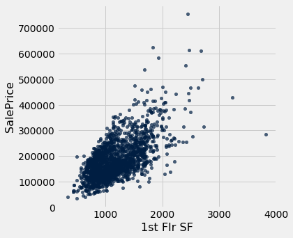
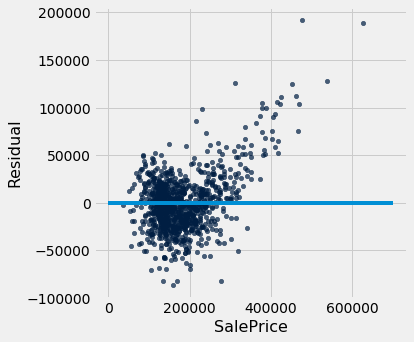
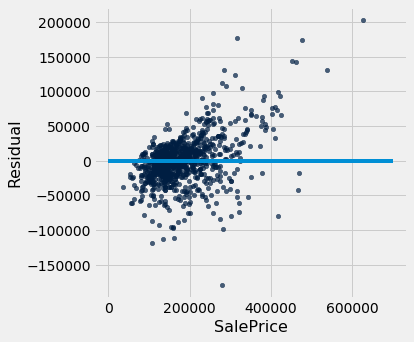

---
redirect_from:
  - "/chapters/17/6/multiple-regression"
interact_link: content/chapters/17/6/Multiple_Regression.ipynb
kernel_name: python3
has_widgets: false
title: 'Multiple Regression'
prev_page:
  url: /chapters/17/5/Accuracy_of_the_Classifier
  title: 'The Accuracy of the Classifier'
next_page:
  url: /chapters/18/Updating_Predictions
  title: 'Updating Predictions'
comment: "***PROGRAMMATICALLY GENERATED, DO NOT EDIT. SEE ORIGINAL FILES IN /content***"
---


<div markdown="1" class="cell code_cell">


</div>


<div markdown="1" class="cell code_cell">


</div>


Now that we have explored ways to use multiple attributes to predict a categorical variable, let us return to predicting a quantitative variable. Predicting a numerical quantity is called regression, and a commonly used method to use multiple attributes for regression is called *multiple linear regression*.

## Home Prices

The following dataset of house prices and attributes was collected over several years for the city of Ames, Iowa. A [description of the dataset appears online](http://ww2.amstat.org/publications/jse/v19n3/decock.pdf). We will focus only a subset of the columns. We will try to predict the sale price column from the other columns.


<div markdown="1" class="cell code_cell">
<div class="input_area" markdown="1">
```python
all_sales = Table.read_table(path_data + 'house.csv')
sales = all_sales.where('Bldg Type', '1Fam').where('Sale Condition', 'Normal').select(
    'SalePrice', '1st Flr SF', '2nd Flr SF', 
    'Total Bsmt SF', 'Garage Area', 
    'Wood Deck SF', 'Open Porch SF', 'Lot Area', 
    'Year Built', 'Yr Sold')
sales.sort('SalePrice')

```
</div>

<div class="output_wrapper" markdown="1">
<div class="output_subarea" markdown="1">


<div markdown="0" class="output output_html">
<table border="1" class="dataframe">
    <thead>
        <tr>
            <th>SalePrice</th> <th>1st Flr SF</th> <th>2nd Flr SF</th> <th>Total Bsmt SF</th> <th>Garage Area</th> <th>Wood Deck SF</th> <th>Open Porch SF</th> <th>Lot Area</th> <th>Year Built</th> <th>Yr Sold</th>
        </tr>
    </thead>
    <tbody>
        <tr>
            <td>35000    </td> <td>498       </td> <td>0         </td> <td>498          </td> <td>216        </td> <td>0           </td> <td>0            </td> <td>8088    </td> <td>1922      </td> <td>2006   </td>
        </tr>
        <tr>
            <td>39300    </td> <td>334       </td> <td>0         </td> <td>0            </td> <td>0          </td> <td>0           </td> <td>0            </td> <td>5000    </td> <td>1946      </td> <td>2007   </td>
        </tr>
        <tr>
            <td>40000    </td> <td>649       </td> <td>668       </td> <td>649          </td> <td>250        </td> <td>0           </td> <td>54           </td> <td>8500    </td> <td>1920      </td> <td>2008   </td>
        </tr>
        <tr>
            <td>45000    </td> <td>612       </td> <td>0         </td> <td>0            </td> <td>308        </td> <td>0           </td> <td>0            </td> <td>5925    </td> <td>1940      </td> <td>2009   </td>
        </tr>
        <tr>
            <td>52000    </td> <td>729       </td> <td>0         </td> <td>270          </td> <td>0          </td> <td>0           </td> <td>0            </td> <td>4130    </td> <td>1935      </td> <td>2008   </td>
        </tr>
        <tr>
            <td>52500    </td> <td>693       </td> <td>0         </td> <td>693          </td> <td>0          </td> <td>0           </td> <td>20           </td> <td>4118    </td> <td>1941      </td> <td>2006   </td>
        </tr>
        <tr>
            <td>55000    </td> <td>723       </td> <td>363       </td> <td>723          </td> <td>400        </td> <td>0           </td> <td>24           </td> <td>11340   </td> <td>1920      </td> <td>2008   </td>
        </tr>
        <tr>
            <td>55000    </td> <td>796       </td> <td>0         </td> <td>796          </td> <td>0          </td> <td>0           </td> <td>0            </td> <td>3636    </td> <td>1922      </td> <td>2008   </td>
        </tr>
        <tr>
            <td>57625    </td> <td>810       </td> <td>0         </td> <td>0            </td> <td>280        </td> <td>119         </td> <td>24           </td> <td>21780   </td> <td>1910      </td> <td>2009   </td>
        </tr>
        <tr>
            <td>58500    </td> <td>864       </td> <td>0         </td> <td>864          </td> <td>200        </td> <td>0           </td> <td>0            </td> <td>8212    </td> <td>1914      </td> <td>2010   </td>
        </tr>
    </tbody>
</table>
<p>... (1992 rows omitted)</p>
</div>


</div>
</div>
</div>


A histogram of sale prices shows a large amount of variability and a distribution that is clearly not normal. A long tail to the right contains a few houses that had very high prices. The short left tail does not contain any houses that sold for less than $35,000.


<div markdown="1" class="cell code_cell">
<div class="input_area" markdown="1">
```python
sales.hist('SalePrice', bins=32, unit='$')

```
</div>

<div class="output_wrapper" markdown="1">
<div class="output_subarea" markdown="1">

{:.output_png}


</div>
</div>
</div>


#### Correlation

No single attribute is sufficient to predict the sale price. For example, the area of first floor, measured in square feet, correlates with sale price but only explains some of its variability.


<div markdown="1" class="cell code_cell">
<div class="input_area" markdown="1">
```python
sales.scatter('1st Flr SF', 'SalePrice')

```
</div>

<div class="output_wrapper" markdown="1">
<div class="output_subarea" markdown="1">

{:.output_png}


</div>
</div>
</div>


<div markdown="1" class="cell code_cell">
<div class="input_area" markdown="1">
```python
correlation(sales, 'SalePrice', '1st Flr SF')

```
</div>

<div class="output_wrapper" markdown="1">
<div class="output_subarea" markdown="1">


{:.output_data_text}
```
0.6424662541030225
```


</div>
</div>
</div>


In fact, none of the individual attributes have a correlation with sale price that is above 0.7 (except for the sale price itself).


<div markdown="1" class="cell code_cell">
<div class="input_area" markdown="1">
```python
for label in sales.labels:
    print('Correlation of', label, 'and SalePrice:\t', correlation(sales, label, 'SalePrice'))

```
</div>

<div class="output_wrapper" markdown="1">
<div class="output_subarea" markdown="1">
{:.output_stream}
```
Correlation of SalePrice and SalePrice:	 1.0
Correlation of 1st Flr SF and SalePrice:	 0.6424662541030225
Correlation of 2nd Flr SF and SalePrice:	 0.3575218942800824
Correlation of Total Bsmt SF and SalePrice:	 0.652978626757169
Correlation of Garage Area and SalePrice:	 0.6385944852520443
Correlation of Wood Deck SF and SalePrice:	 0.3526986661950492
Correlation of Open Porch SF and SalePrice:	 0.3369094170263733
Correlation of Lot Area and SalePrice:	 0.2908234551157694
Correlation of Year Built and SalePrice:	 0.5651647537135916
Correlation of Yr Sold and SalePrice:	 0.02594857908072111
```
</div>
</div>
</div>


However, combining attributes can provide higher correlation. In particular, if we sum the first floor and second floor areas, the result has a higher correlation than any single attribute alone.


<div markdown="1" class="cell code_cell">
<div class="input_area" markdown="1">
```python
both_floors = sales.column(1) + sales.column(2)
correlation(sales.with_column('Both Floors', both_floors), 'SalePrice', 'Both Floors')

```
</div>

<div class="output_wrapper" markdown="1">
<div class="output_subarea" markdown="1">


{:.output_data_text}
```
0.7821920556134877
```


</div>
</div>
</div>


This high correlation indicates that we should try to use more than one attribute to predict the sale price. In a dataset with multiple observed attributes and a single numerical value to be predicted (the sale price in this case), multiple linear regression can be an effective technique.

## Multiple Linear Regression

In multiple linear regression, a numerical output is predicted from numerical input attributes by multiplying each attribute value by a different slope, then summing the results. In this example, the slope for the `1st Flr SF` would represent the dollars per square foot of area on the first floor of the house that should be used in our prediction. 

Before we begin prediction, we split our data randomly into a training and test set of equal size.


<div markdown="1" class="cell code_cell">
<div class="input_area" markdown="1">
```python
train, test = sales.split(1001)
print(train.num_rows, 'training and', test.num_rows, 'test instances.')

```
</div>

<div class="output_wrapper" markdown="1">
<div class="output_subarea" markdown="1">
{:.output_stream}
```
1001 training and 1001 test instances.
```
</div>
</div>
</div>


The slopes in multiple regression is an array that has one slope value for each attribute in an example. Predicting the sale price involves multiplying each attribute by the slope and summing the result.


<div markdown="1" class="cell code_cell">
<div class="input_area" markdown="1">
```python
def predict(slopes, row):
    return sum(slopes * np.array(row))

example_row = test.drop('SalePrice').row(0)
print('Predicting sale price for:', example_row)
example_slopes = np.random.normal(10, 1, len(example_row))
print('Using slopes:', example_slopes)
print('Result:', predict(example_slopes, example_row))

```
</div>

<div class="output_wrapper" markdown="1">
<div class="output_subarea" markdown="1">
{:.output_stream}
```
Predicting sale price for: Row(1st Flr SF=707, 2nd Flr SF=707, Total Bsmt SF=707.0, Garage Area=403.0, Wood Deck SF=100, Open Porch SF=35, Lot Area=7750, Year Built=2002, Yr Sold=2008)
Using slopes: [ 9.70697704  8.68451487  9.48574052 11.65887763  9.76283493  7.75180442
 10.26963618 12.39555854  9.93561073]
Result: 150011.62264018963
```
</div>
</div>
</div>


The result is an estimated sale price, which can be compared to the actual sale price to assess whether the slopes provide accurate predictions. Since the `example_slopes` above were chosen at random, we should not expect them to provide accurate predictions at all.


<div markdown="1" class="cell code_cell">
<div class="input_area" markdown="1">
```python
print('Actual sale price:', test.column('SalePrice').item(0))
print('Predicted sale price using random slopes:', predict(example_slopes, example_row))

```
</div>

<div class="output_wrapper" markdown="1">
<div class="output_subarea" markdown="1">
{:.output_stream}
```
Actual sale price: 176000
Predicted sale price using random slopes: 150011.62264018963
```
</div>
</div>
</div>


#### Least Squares Regression

The next step in performing multiple regression is to define the least squares objective. We perform the prediction for each row in the training set, and then compute the root mean squared error (RMSE) of the predictions from the actual prices.


<div markdown="1" class="cell code_cell">
<div class="input_area" markdown="1">
```python
train_prices = train.column(0)
train_attributes = train.drop(0)

def rmse(slopes, attributes, prices):
    errors = []
    for i in np.arange(len(prices)):
        predicted = predict(slopes, attributes.row(i))
        actual = prices.item(i)
        errors.append((predicted - actual) ** 2)
    return np.mean(errors) ** 0.5

def rmse_train(slopes):
    return rmse(slopes, train_attributes, train_prices)

print('RMSE of all training examples using random slopes:', rmse_train(example_slopes))

```
</div>

<div class="output_wrapper" markdown="1">
<div class="output_subarea" markdown="1">
{:.output_stream}
```
RMSE of all training examples using random slopes: 103585.76518182222
```
</div>
</div>
</div>


Finally, we use the `minimize` function to find the slopes with the lowest RMSE. Since the function we want to minimize, `rmse_train`, takes an array instead of a number, we must pass the `array=True` argument to `minimize`. When this argument is used, `minimize` also requires an initial guess of the slopes so that it knows the dimension of the input array. Finally, to speed up optimization, we indicate that `rmse_train` is a smooth function using the `smooth=True` attribute. Computation of the best slopes may take several minutes.


<div markdown="1" class="cell code_cell">
<div class="input_area" markdown="1">
```python
best_slopes = minimize(rmse_train, start=example_slopes, smooth=True, array=True)
print('The best slopes for the training set:')
Table(train_attributes.labels).with_row(list(best_slopes)).show()
print('RMSE of all training examples using the best slopes:', rmse_train(best_slopes))

```
</div>

<div class="output_wrapper" markdown="1">
<div class="output_subarea" markdown="1">
{:.output_stream}
```
The best slopes for the training set:
```
</div>
</div>
<div class="output_wrapper" markdown="1">
<div class="output_subarea" markdown="1">

<div markdown="0" class="output output_html">
<table border="1" class="dataframe">
    <thead>
        <tr>
            <th>1st Flr SF</th> <th>2nd Flr SF</th> <th>Total Bsmt SF</th> <th>Garage Area</th> <th>Wood Deck SF</th> <th>Open Porch SF</th> <th>Lot Area</th> <th>Year Built</th> <th>Yr Sold</th>
        </tr>
    </thead>
    <tbody>
        <tr>
            <td>78.7701   </td> <td>75.9304   </td> <td>49.6108      </td> <td>42.9615    </td> <td>38.8186     </td> <td>13.2336      </td> <td>0.328059</td> <td>510.312   </td> <td>-508.186</td>
        </tr>
    </tbody>
</table>
</div>

</div>
</div>
<div class="output_wrapper" markdown="1">
<div class="output_subarea" markdown="1">
{:.output_stream}
```
RMSE of all training examples using the best slopes: 32283.50513136445
```
</div>
</div>
</div>


#### Interpreting Multiple Regression

Let's interpret these results. The best slopes give us a method for estimating the price of a house from its attributes. A square foot of area on the first floor is worth about \\$75 (the first slope), while one on the second floor is worth about \\$70 (the second slope). The final negative value describes the market: prices in later years were lower on average.

The RMSE of around \\$30,000 means that our best linear prediction of the sale price based on all of the attributes is off by around \\$30,000 on the training set, on average.  We find a similar error when predicting prices on the test set, which indicates that our prediction method will generalize to other samples from the same population.


<div markdown="1" class="cell code_cell">
<div class="input_area" markdown="1">
```python
test_prices = test.column(0)
test_attributes = test.drop(0)

def rmse_test(slopes):
    return rmse(slopes, test_attributes, test_prices)

rmse_linear = rmse_test(best_slopes)
print('Test set RMSE for multiple linear regression:', rmse_linear)

```
</div>

<div class="output_wrapper" markdown="1">
<div class="output_subarea" markdown="1">
{:.output_stream}
```
Test set RMSE for multiple linear regression: 29898.407434368237
```
</div>
</div>
</div>


If the predictions were perfect, then a scatter plot of the predicted and actual values would be a straight line with slope 1. We see that most dots fall near that line, but there is some error in the predictions.


<div markdown="1" class="cell code_cell">
<div class="input_area" markdown="1">
```python
def fit(row):
    return sum(best_slopes * np.array(row))

test.with_column('Fitted', test.drop(0).apply(fit)).scatter('Fitted', 0)
plots.plot([0, 5e5], [0, 5e5]);

```
</div>

<div class="output_wrapper" markdown="1">
<div class="output_subarea" markdown="1">

{:.output_png}


</div>
</div>
</div>


A residual plot for multiple regression typically compares the errors (residuals) to the actual values of the predicted variable. We see in the residual plot below that we have systematically underestimated the value of expensive houses, shown by the many positive residual values on the right side of the graph.


<div markdown="1" class="cell code_cell">
<div class="input_area" markdown="1">
```python
test.with_column('Residual', test_prices-test.drop(0).apply(fit)).scatter(0, 'Residual')
plots.plot([0, 7e5], [0, 0]);

```
</div>

<div class="output_wrapper" markdown="1">
<div class="output_subarea" markdown="1">

{:.output_png}


</div>
</div>
</div>


As with simple linear regression, interpreting the result of a predictor is at least as important as making predictions. There are many lessons about interpreting multiple regression that are not included in this textbook. A natural next step after completing this text would be to study linear modeling and regression in further depth.


## Nearest Neighbors for Regression

Another approach to predicting the sale price of a house is to use the price of similar houses. This *nearest neighbor* approach is very similar to our classifier. To speed up computation, we will only use the attributes that had the highest correlation with the sale price in our original analysis.


<div markdown="1" class="cell code_cell">
<div class="input_area" markdown="1">
```python
train_nn = train.select(0, 1, 2, 3, 4, 8)
test_nn = test.select(0, 1, 2, 3, 4, 8)
train_nn.show(3)

```
</div>

<div class="output_wrapper" markdown="1">
<div class="output_subarea" markdown="1">

<div markdown="0" class="output output_html">
<table border="1" class="dataframe">
    <thead>
        <tr>
            <th>SalePrice</th> <th>1st Flr SF</th> <th>2nd Flr SF</th> <th>Total Bsmt SF</th> <th>Garage Area</th> <th>Year Built</th>
        </tr>
    </thead>
    <tbody>
        <tr>
            <td>67500    </td> <td>1012      </td> <td>0         </td> <td>816          </td> <td>429        </td> <td>1920      </td>
        </tr>
        <tr>
            <td>116000   </td> <td>734       </td> <td>384       </td> <td>648          </td> <td>440        </td> <td>1920      </td>
        </tr>
        <tr>
            <td>228500   </td> <td>1689      </td> <td>0         </td> <td>1680         </td> <td>432        </td> <td>1991      </td>
        </tr>
    </tbody>
</table>
<p>... (998 rows omitted)</p>
</div>

</div>
</div>
</div>


The computation of closest neighbors is identical to a nearest-neighbor classifier. In this case, we will exclude the `'SalePrice'` rather than the `'Class'` column from the distance computation. The five nearest neighbors of the first test row are shown below.


<div markdown="1" class="cell code_cell">
<div class="input_area" markdown="1">
```python
def distance(pt1, pt2):
    """The distance between two points, represented as arrays."""
    return np.sqrt(sum((pt1 - pt2) ** 2))

def row_distance(row1, row2):
    """The distance between two rows of a table."""
    return distance(np.array(row1), np.array(row2))

def distances(training, example, output):
    """Compute the distance from example for each row in training."""
    dists = []
    attributes = training.drop(output)
    for row in attributes.rows:
        dists.append(row_distance(row, example))
    return training.with_column('Distance', dists)

def closest(training, example, k, output):
    """Return a table of the k closest neighbors to example."""
    return distances(training, example, output).sort('Distance').take(np.arange(k))

example_nn_row = test_nn.drop(0).row(0)
closest(train_nn, example_nn_row, 5, 'SalePrice')

```
</div>

<div class="output_wrapper" markdown="1">
<div class="output_subarea" markdown="1">


<div markdown="0" class="output output_html">
<table border="1" class="dataframe">
    <thead>
        <tr>
            <th>SalePrice</th> <th>1st Flr SF</th> <th>2nd Flr SF</th> <th>Total Bsmt SF</th> <th>Garage Area</th> <th>Year Built</th> <th>Distance</th>
        </tr>
    </thead>
    <tbody>
        <tr>
            <td>175000   </td> <td>729       </td> <td>717       </td> <td>729          </td> <td>406        </td> <td>1996      </td> <td>33.3617 </td>
        </tr>
        <tr>
            <td>176000   </td> <td>728       </td> <td>728       </td> <td>728          </td> <td>400        </td> <td>2005      </td> <td>36.6197 </td>
        </tr>
        <tr>
            <td>189000   </td> <td>728       </td> <td>728       </td> <td>728          </td> <td>410        </td> <td>2005      </td> <td>37.1618 </td>
        </tr>
        <tr>
            <td>159500   </td> <td>698       </td> <td>728       </td> <td>690          </td> <td>440        </td> <td>1977      </td> <td>52.9623 </td>
        </tr>
        <tr>
            <td>174000   </td> <td>742       </td> <td>742       </td> <td>742          </td> <td>390        </td> <td>2005      </td> <td>62.0725 </td>
        </tr>
    </tbody>
</table>
</div>


</div>
</div>
</div>


One simple method for predicting the price is to average the prices of the nearest neighbors.


<div markdown="1" class="cell code_cell">
<div class="input_area" markdown="1">
```python
def predict_nn(example):
    """Return the majority class among the k nearest neighbors."""
    return np.average(closest(train_nn, example, 5, 'SalePrice').column('SalePrice'))

predict_nn(example_nn_row)

```
</div>

<div class="output_wrapper" markdown="1">
<div class="output_subarea" markdown="1">


{:.output_data_text}
```
174700.0
```


</div>
</div>
</div>


Finally, we can inspect whether our prediction is close to the true sale price for our one test example. Looks reasonable!


<div markdown="1" class="cell code_cell">
<div class="input_area" markdown="1">
```python
print('Actual sale price:', test_nn.column('SalePrice').item(0))
print('Predicted sale price using nearest neighbors:', predict_nn(example_nn_row))

```
</div>

<div class="output_wrapper" markdown="1">
<div class="output_subarea" markdown="1">
{:.output_stream}
```
Actual sale price: 176000
Predicted sale price using nearest neighbors: 174700.0
```
</div>
</div>
</div>


#### Evaluation

To evaluate the performance of this approach for the whole test set, we apply `predict_nn` to each test example, then compute the root mean squared error of the predictions. Computation of the predictions may take several minutes.


<div markdown="1" class="cell code_cell">
<div class="input_area" markdown="1">
```python
nn_test_predictions = test_nn.drop('SalePrice').apply(predict_nn)
rmse_nn = np.mean((test_prices - nn_test_predictions) ** 2) ** 0.5

print('Test set RMSE for multiple linear regression: ', rmse_linear)
print('Test set RMSE for nearest neighbor regression:', rmse_nn)

```
</div>

<div class="output_wrapper" markdown="1">
<div class="output_subarea" markdown="1">
{:.output_stream}
```
Test set RMSE for multiple linear regression:  29898.407434368237
Test set RMSE for nearest neighbor regression: 33424.833033298106
```
</div>
</div>
</div>


For these data, the errors of the two techniques are quite similar! For different data sets, one technique might outperform another. By computing the RMSE of both techniques on the same data, we can compare methods fairly. One note of caution: the difference in performance might not be due to the technique at all; it might be due to the random variation due to sampling the training and test sets in the first place.

Finally, we can draw a residual plot for these predictions. We still underestimate the prices of the most expensive houses, but the bias does not appear to be as systematic. However, fewer residuals are very close to zero, indicating that fewer prices were predicted with very high accuracy. 


<div markdown="1" class="cell code_cell">
<div class="input_area" markdown="1">
```python
test.with_column('Residual', test_prices-nn_test_predictions).scatter(0, 'Residual')
plots.plot([0, 7e5], [0, 0]);

```
</div>

<div class="output_wrapper" markdown="1">
<div class="output_subarea" markdown="1">

{:.output_png}


</div>
</div>
</div>

